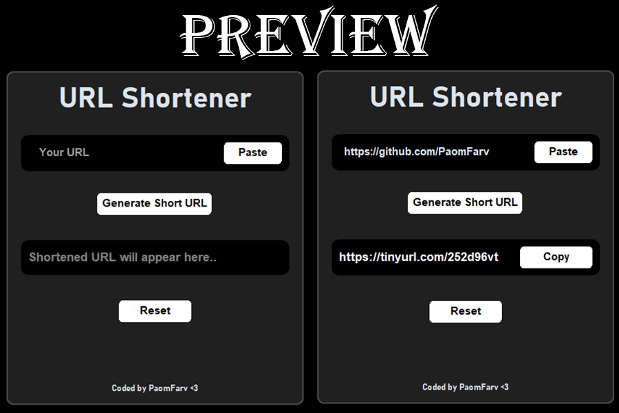

# 🔗 URL Shortener

A sleek and modern desktop app built with Python and CustomTkinter that shortens long URLs using the TinyURL API. Paste, shorten, copy, and reset—all in one neat interface.

---

## 💡 Features

- Paste URL directly from clipboard
- Generate a shortened URL using TinyURL
- Copy the short URL back to clipboard
- Reset fields with a single click
- Clean, dark-mode-friendly UI using `customtkinter`

---

## 📦 Requirements

Install the required libraries before running:

```bash
pip install customtkinter pyshorteners pyperclip
```

---

## 🚀 How to Run

```bash
python url_shortener.py
```

---

## 🖼️ Screenshot



---

## 👨‍💻 Author

**Coded by PaomFarv <3**

---

## 📜 License

This project is open-source and free to use under the [MIT License](LICENSE).
